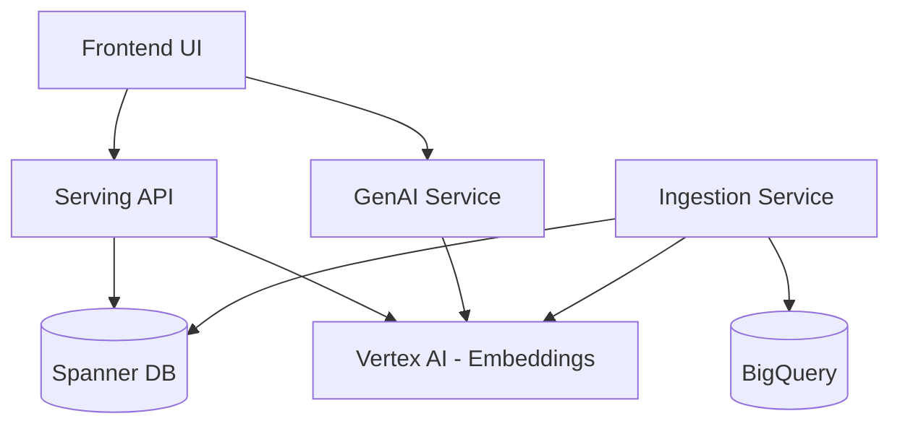

# PSearch: AI-Powered Product Search Platform

## Overview

PSearch is an advanced product search platform built on Google Cloud Platform. It leverages **Spanner's native hybrid search capabilities**, combining traditional text search with vector similarity search (using embeddings generated via Vertex AI) to understand the semantic meaning behind user queries. This results in more accurate, contextually relevant product search results stored and queried directly within Spanner.

**Core Features:**

* **Spanner Hybrid Search:** Blends vector similarity and text search directly within Google Cloud Spanner for relevance and efficiency
* **AI Enhancements:** Includes AI-driven filter suggestions, content enrichment (text with Gemini, images with Imagen), and marketing content generation
* **Product Filtering:** Supports filtering by various attributes (categories, brands, price, etc.)
* **Rules Engine:** Allows administrators to configure search behavior (with planned implementation in Spanner)
* **Scalable Architecture:** Built with microservices on Google Cloud (Cloud Run)
* **Modern UI:** Responsive React-based user interface with AI feature integration

## Project Status

| Component | Status | Notes |
|-----------|--------|-------|
| Core Search | ✅ Complete | Hybrid search combining vector and text search in Spanner |
| Frontend UI | ✅ Complete | React-based UI with product search and filtering |
| Ingestion | ⚠️ In Progress | Basic functionality working, generic data sources in development |
| GenAI | ✅ Complete | Content enrichment, image enhancement, and marketing generation |
| Rules Engine | 🔄 Refactoring | Currently using mock data, migrating from Firestore to Spanner |

## Architecture

PSearch utilizes a microservices architecture deployed on Google Cloud:



### Core Services

* **Frontend UI (React `src/application/ui/`):** Provides the user interface for searching, filtering, viewing products, and interacting with AI enhancements.

* **Serving API (Go/Gin `src/psearch/serving/`):** Handles search requests, performs hybrid search directly against Spanner using its native vector and text search capabilities, generates query embeddings via Vertex AI, retrieves data from Spanner, and interacts with other services.

* **Rules Management:** Currently implemented as a mock service in the UI with localStorage persistence. Future implementation will use Spanner for rules storage.

* **Ingestion Pipeline (Cloud Run Job/Python `src/psearch/ingestion/`):** Processes product data (e.g., from BigQuery), generates embeddings using Vertex AI, and stores both structured data and embeddings directly into Spanner.

* **GenAI Service (Cloud Run/Python `src/psearch/gen_ai/`):** Provides generative AI capabilities:
  * Content enrichment with Gemini
  * Image enhancement with Gemini
  * Marketing content generation
  * Conversational search features

### Datastores

* **Spanner:** 
  * Primary storage for structured product data *and* vector embeddings
  * Enables integrated hybrid search
  * Planned storage for rules configuration (consolidating all data storage)

* **BigQuery:** 
  * Used for analytics
  * Potential source for the ingestion pipeline

## Technology Stack

* **Frontend:** 
  * React with hooks for state management
  * Material-UI for components
  * Axios for API requests

* **Backend:** 
  * Go (Gin) for high-performance Serving API
  * Python for AI-related services and data processing

* **Databases:** 
  * Google Cloud Spanner with vector search capabilities
  * Google Cloud BigQuery for analytics

* **AI/ML:** 
  * Google Vertex AI Embeddings for semantic search
  * Gemini 2.0 for text generation and content enrichment
  * Gemini for image enhancement and generation

* **Infrastructure:** 
  * Google Cloud Run for serverless microservices
  * Google Cloud Build for CI/CD
  * Terraform for infrastructure as code
  * Docker for containerization

## Repository Structure

```
├── docs/                            # Project documentation
│   ├── contributing.md              # Contribution guidelines
│   └── USAGE.md                     # Detailed usage instructions
├── memory-bank/                     # Project knowledge management
│   ├── projectbrief.md              # Core project requirements
│   ├── systemPatterns.md            # System architecture
│   ├── techContext.md               # Technical context and constraints
│   └── *.md                         # Other project documentation
├── src/
│   ├── analytics/                   # Analytics components
│   ├── application/                 # Frontend application
│   │   ├── ui/                      # React-based user interface
│   │   │   ├── src/                 # UI source code
│   │   │   │   ├── components/      # React components
│   │   │   │   └── services/        # Frontend services
│   │   │   └── public/              # Static assets
│   ├── iac/                         # Infrastructure as Code (Terraform)
│   │   ├── modules/                 # Terraform modules
│   │   │   ├── gen_ai/              # GenAI service infrastructure
│   │   │   ├── ingestion/           # Ingestion pipeline infrastructure
│   │   │   ├── search_api/          # Search API infrastructure
│   │   │   └── spanner/             # Spanner database infrastructure
│   │   └── main.tf                  # Main Terraform configuration
│   ├── psearch/                     # Backend services
│   │   ├── gen_ai/                  # GenAI service
│   │   │   └── services/            # AI service implementations
│   │   ├── ingestion/               # Data ingestion pipeline
│   │   │   └── services/            # Ingestion service implementations
│   │   └── serving/                 # Go-based search API
│   │       ├── cmd/                 # Entry points
│   │       └── internal/            # Internal implementation
│   └── tooling/                     # Development and operational tools
├── .gitignore                       # Git ignore file
├── LICENSE                          # Apache 2.0 License file
└── README.md                        # This file
```

## Hybrid Search Implementation

PSearch's core search functionality leverages Spanner's ability to store and query both structured data and vector embeddings in a single database. The hybrid search combines:

1. **Vector Similarity Search:** Using APPROX_COSINE_DISTANCE with embeddings generated by Vertex AI
2. **Full-Text Search:** Using Spanner's native text search capabilities
3. **Fusion Algorithm:** Combining results using Reciprocal Rank Fusion (RRF)

This approach provides several advantages:
- More relevant results by combining semantic meaning with keyword matching
- Simplified architecture by using a single datastore
- Lower latency by avoiding synchronization between separate databases
- Scalability through Spanner's distributed architecture

## Setup and Deployment

### Prerequisites

* Google Cloud SDK (`gcloud`) installed and authenticated
* Terraform installed
* Docker installed
* Go 1.21+ installed (for Serving API)
* Python 3.9+ installed (for other services)
* Node.js and npm/yarn installed (for UI development/deployment)
* A Google Cloud Project with billing enabled and required APIs enabled (Spanner, Cloud Run, Cloud Build, Vertex AI, etc.)

### Clone Repository

```bash
git clone <repository-url>
cd psearch
```

### Configure Infrastructure

1. Navigate to the IaC directory:
   ```bash
   cd src/iac
   ```

2. Create a `terraform.tfvars` file (or set environment variables):
   ```hcl
   project_id     = "your-gcp-project-id"
   region         = "your-gcp-region"        # e.g., "us-central1"
   project_number = "your-gcp-project-number"
   # Other variables as needed (see variables.tf files in modules)
   # Ensure Spanner instance meets minimum PU requirements for vector search (>=1000)
   ```

   *Note:* You can find your project number using:
   ```bash
   gcloud projects describe your-gcp-project-id --format='value(projectNumber)'
   ```

3. The Spanner schema (`src/iac/modules/spanner/schema.sql`) defines the necessary tables, vector columns, and indexes for hybrid search.

### Provision Infrastructure

1. Initialize Terraform:
   ```bash
   terraform init
   ```

2. Apply the Terraform configuration:
   ```bash
   terraform apply
   ```
   Review the plan and type `yes` to confirm. This process may take several minutes.

### Deploy Application Services

The `terraform apply` command provisions infrastructure and triggers Cloud Build pipelines defined in the respective service directories:
* `src/psearch/serving/cloudbuild.yaml`
* `src/psearch/ingestion/cloudbuild.yaml`
* `src/psearch/gen_ai/cloudbuild.yaml`
* `src/application/ui/cloudbuild.yaml`

These build the Docker images and deploy them to Cloud Run. Monitor build progress in the Google Cloud Console under Cloud Build.

### Local Development

For local development:

1. **UI Development:**
   ```bash
   cd src/application/ui
   npm install
   npm start
   ```
   This will start a development server on http://localhost:3000.

2. **Go API Development:**
   ```bash
   cd src/psearch/serving
   go mod download
   go run cmd/server/main.go
   ```
   This will start the Go API server on http://localhost:8080.

3. **GenAI Services Development:**
   ```bash
   cd src/psearch/gen_ai
   python -m pip install -r requirements.txt
   python main.py
   ```
   This will start the GenAI services on http://localhost:8081.

## Data Ingestion

The ingestion process uses a Cloud Run Job (`src/psearch/ingestion/`) to read product data, generate embeddings, and load into Spanner.

1. **Prepare Source Data:**
   * Default source is a BigQuery table
   * Schema should align with the Spanner table defined in `src/iac/modules/spanner/schema.sql`
   * Key fields include `id`, `title`, `description`, `images`, `categories`, `brands`, etc.
   * Work is in progress to support multiple data sources (see `TODO.md`)

2. **Execute the Ingestion Job:**
   * Using Google Cloud Console:
     1. Navigate to Cloud Run in the Google Cloud Console
     2. Select the "Jobs" tab
     3. Find the job named `product-ingestion`
     4. Click "Execute" to start the job run
   * Using `gcloud` command line:
     ```bash
     gcloud run jobs execute product-ingestion --region your-gcp-region --project your-gcp-project-id --wait
     ```

## API Usage

### Search API

The Go-based Serving API provides the main search functionality:

1. **Find API URL:**
   ```bash
   cd src/iac
   terraform output -raw search_api_service_url
   ```

2. **Example Search Request:**
   ```bash
   API_URL=$(terraform output -raw search_api_service_url)
   curl -X POST "${API_URL}/search" \
        -H "Content-Type: application/json" \
        -d '{
              "query": "stylish red running shoes",
              "limit": 10,
              "alpha": 0.6
            }'
   ```

### GenAI Services

The Python-based GenAI services provide AI enhancement capabilities:

1. **Content Enrichment:**
   ```bash
   curl -X POST "${GENAI_URL}/enrich" \
        -H "Content-Type: application/json" \
        -d '{
              "product_id": "123",
              "product_data": {...},
              "fields_to_enrich": ["description", "features"]
            }'
   ```

2. **Image Enhancement:**
   ```bash
   curl -X POST "${GENAI_URL}/enhance-image" \
        -H "Content-Type: application/json" \
        -d '{
              "product_id": "123",
              "product_data": {...},
              "image_base64": "...",
              "background_prompt": "modern kitchen"
            }'
   ```

## Troubleshooting

### Common Issues

1. **Spanner Permissions:**
   * Ensure the service accounts have the necessary permissions for Spanner operations
   * Check IAM roles in Google Cloud Console

2. **Vector Search Requirements:**
   * Spanner must have at least 1000 Processing Units for vector search
   * Verify in the Spanner console that the instance has enough capacity

3. **Embedding Generation:**
   * If search results are poor, verify that embeddings are being generated correctly
   * Check logs for embedding generation failures

4. **API Connectivity:**
   * If UI can't connect to backend services, check CORS configuration
   * Verify that service URLs are correctly configured in the UI

## Contributing

Please see [docs/contributing.md](docs/contributing.md) for details on how to contribute to this project.

## License

This project is licensed under the Apache License, Version 2.0. See the [LICENSE](LICENSE) file for details.

## Disclaimer

This is not an officially supported Google product. This project is not eligible for the [Google Open Source Software Vulnerability Rewards Program](https://bughunters.google.com/open-source-security).
